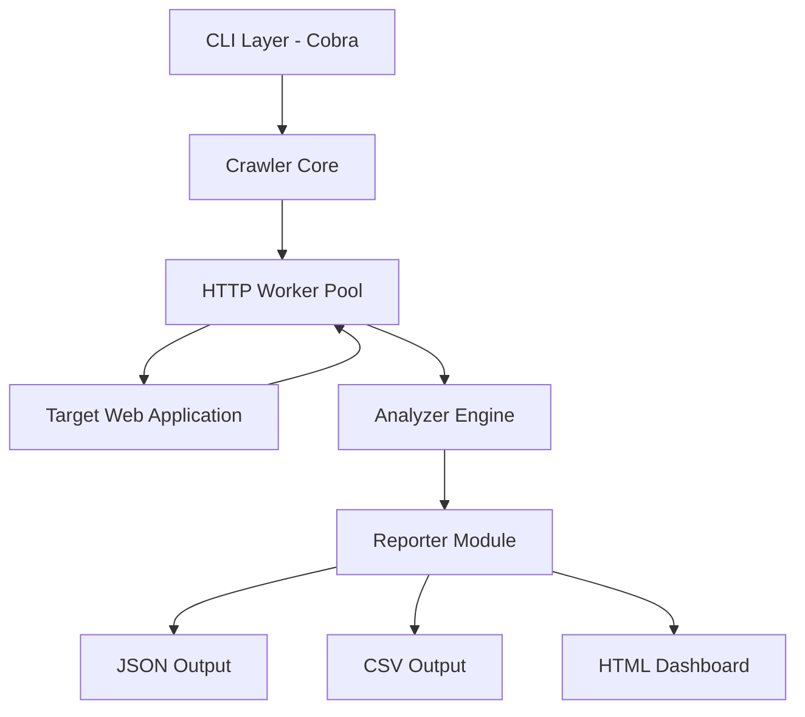

# 🔍 LinkSleuth

[](https://go.dev/)
[](https://opensource.org/licenses/MIT)
[](https://goreportcard.com/report/github.com/ismailtsdln/LinkSleuth)

**LinkSleuth** is a high-performance, modular URL discovery and security analysis tool written in Go. Designed for security researchers, bug hunters, and developers, it provides deep insights into web application structures through concurrent crawling, sensitive endpoint detection, and comprehensive reporting.

---

## 🚀 Key Features

- **⚡ High-Speed Discovery**: Concurrent scanning using optimized worker pools.
- **🛡️ Security Focused**: Automatic detection of sensitive files (`.env`, `config`, `backup`) and administrative endpoints.
- **📊 Rich Reporting**: Export results in structured **JSON**, **CSV**, or interactive **HTML** dashboards.
- **🔁 Built-in Resilience**: Automatic retries with exponential backoff and HTTP 429 (Rate Limit) handling.
- **🎭 Stealthy Operations**: Random User-Agent rotation to bypass basic WAF and rate-limiting rules.
- **🧩 Modular Core**: Extensible analyzer and reporter architecture.

---

## 🛠️ Installation

### Using Go Install (Recommended)

```bash
go install github.com/ismailtsdln/linksluth@latest
```

### From Source

```bash
git clone https://github.com/ismailtsdln/LinkSleuth.git
cd LinkSleuth
go build -o linksluth main.go
```

---

## 📖 Usage Guide

### 1. Basic Scan

Scan a target domain using a wordlist and save results to a JSON file.

```bash
./linksluth scan --url https://example.com --wordlist wordlist.txt --output results.json
```

### 2. Result Analysis

Analyze previously generated results directly in your terminal with colored status codes and findings.

```bash
./linksluth analyze --input results.json
```

### 3. Professional Reporting

Generate a visual HTML report for stakeholders or documentation.

```bash
./linksluth report --input results.json --output report.html
```

---

## ⚙️ Command Line Arguments

| Flag | Short | Description | Default |
|------|-------|-------------|---------|
| `--url` | `-u` | Target URL (Scheme required) | - |
| `--wordlist` | `-w` | Path to directory/file wordlist | - |
| `--threads` | `-t` | Number of concurrent workers | `10` |
| `--retry` | `-r` | Number of retries per failed request | `2` |
| `--agent` | `-a` | Custom User-Agent string | `LinkSleuth/1.0` |
| `--output` | `-o` | Path to save scan results | - |
| `--verbose` | `-v` | Enable detailed debug logging | `false` |

---

## 🏗️ Architecture

LinkSleuth is built with a decoupled architecture for maximum flexibility:

1. **Crawler Core**: Handles networking, concurrency, and worker management.
2. **Analyzer Engine**: Processes HTTP responses and applies security heuristics.
3. **Reporter Module**: Transforms raw data into human-readable and machine-parsable formats.
4. **CLI Layer**: Powered by Cobra for a modern and intuitive user experience.



---

## 🤝 Contributing

Contributions are welcome! Please feel free to submit a Pull Request.

1. Fork the Project
2. Create your Feature Branch (`git checkout -b feature/AmazingFeature`)
3. Commit your Changes (`git commit -m 'Add some AmazingFeature'`)
4. Push to the Branch (`git push origin feature/AmazingFeature`)
5. Open a Pull Request

---

## 📄 License

Distributed under the MIT License. See `LICENSE` for more information.

---

<p align="center">
  Developed with ❤️ by <a href="https://github.com/ismailtsdln">Ismail Tasdelen</a>
</p>
